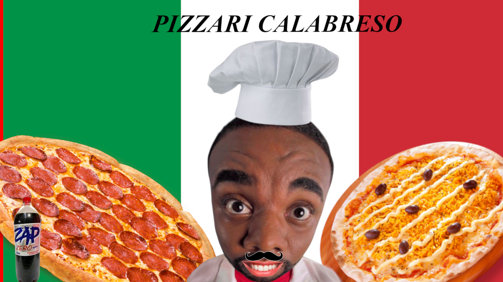
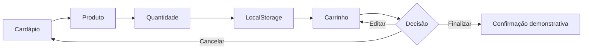

<div align="center">
  

  # Pizzaria Calabreso

  **Cardápio interativo com produtos, carrinho persistente e checkout demonstrativo.**

  [](https://developer.mozilla.org/docs/Web/HTML)
  [](https://developer.mozilla.org/docs/Web/CSS)
  [](https://developer.mozilla.org/docs/Web/JavaScript)
  [](./.github/workflows/ci.yml)
</div>

## Sobre o projeto

A **Pizzaria Calabreso** é uma aplicação front-end educacional que simula a
escolha de pizzas e bebidas. O visitante consulta o cardápio, seleciona a
quantidade, adiciona produtos ao carrinho e acompanha subtotais e valor total.

O carrinho utiliza `localStorage`, mantendo o pedido ao navegar entre as páginas
ou atualizar o navegador. Não existe backend, pagamento ou pedido real.

## Funcionalidades

- Catálogo de seis pizzas e três bebidas;
- página individual para cada pizza;
- cálculo de preço conforme a quantidade;
- agrupamento de produtos repetidos;
- carrinho persistente no navegador;
- edição de quantidades e exclusão de itens;
- cancelamento e finalização demonstrativa;
- renderização segura dos dados do carrinho;
- metadados e textos alternativos para acessibilidade;
- validação automatizada de JavaScript e links locais.

## Fluxo de compra



## Tecnologias

| Tecnologia | Uso |
|---|---|
| HTML5 | Estrutura do catálogo, produtos e carrinho |
| CSS3 | Identidade visual e responsividade |
| JavaScript | Preços, carrinho, validação e navegação |
| LocalStorage | Persistência local do pedido |
| GitHub Actions | Verificação automática do repositório |

## Executando localmente

```bash
git clone https://github.com/Rafa25MF/Pizzaria_Calabreso.git
cd Pizzaria_Calabreso
python -m http.server 5500
```

Acesse `http://localhost:5500`.

Não é necessário instalar pacotes. Para executar a mesma validação usada no CI:

```bash
node scripts/validate-project.mjs
```

## Estrutura

```text
Pizzaria_Calabreso/
├── .github/workflows/ci.yml
├── assets/
│   ├── css/                    # Estilos do catálogo, produtos e carrinho
│   ├── images/banner.png       # Banner usado na interface e no README
│   └── js/
│       ├── produto.js          # Comportamento compartilhado pelas seis pizzas
│       ├── script.js           # Bebidas e total exibido no cardápio
│       └── script_carrinho.js  # Renderização e operações do carrinho
├── design/Banner.xcf       # Arquivo-fonte da arte
├── pizza1.html ... pizza6.html
├── carrinho.html
├── index.html
├── THIRD_PARTY_NOTICES.md
└── README.md
```

## Modelo do carrinho

```js
{
    nome: "Pizza Margherita",
    preco: 25,
    quantidade: 2
}
```

Dados alterados manualmente no `localStorage` são tratados como não confiáveis e
renderizados como texto. Limpar os dados do site remove o pedido salvo.

## Publicação

O projeto pode ser publicado no GitHub Pages selecionando a branch `main` e a
pasta `/ (root)` em **Settings → Pages**.

## Limitações

- A finalização não cria pedido nem cobrança;
- preços e produtos estão definidos nos arquivos;
- imagens externas dependem dos provedores de origem;
- o carrinho existe somente no navegador e dispositivo atuais;
- uso comercial exige backend, autenticação, pagamento e revisão legal.

Consulte [THIRD_PARTY_NOTICES.md](./THIRD_PARTY_NOTICES.md) antes de reutilizar
imagens ou marcas.

## Roadmap

- [ ] Centralizar todo o cardápio em JSON;
- [ ] substituir imagens externas por fotografias próprias;
- [ ] adicionar busca, filtros e cálculo de entrega;
- [ ] implementar API e painel administrativo;
- [ ] adicionar testes funcionais do carrinho;
- [ ] otimizar o banner para formatos modernos.

## Contribuição

Consulte [CONTRIBUTING.md](./CONTRIBUTING.md) antes de enviar alterações. Falhas
de segurança devem seguir as orientações de [SECURITY.md](./SECURITY.md).

## Licença

Código disponibilizado para portfólio e estudo, com todos os direitos reservados.
Consulte [LICENSE](./LICENSE).

## Autor

Desenvolvido por **Rafael** — [@Rafa25MF](https://github.com/Rafa25MF).
